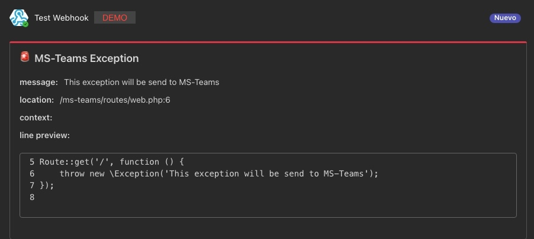

## Laravel Microsoft Teams Report Exceptions

[](https://packagist.org/packages/jtelesforoantonio/laravel-ms-teams-report-exceptions)
[](https://packagist.org/packages/jtelesforoantonio/laravel-ms-teams-report-exceptions)

Send exceptions to Microsoft Teams using the incoming webhook connector.

### Installation

```shell
composer require jtelesforoantonio/laravel-ms-teams-report-exceptions
```

### Usage

The first step is create a webhook, see
how [here](https://learn.microsoft.com/en-us/microsoftteams/platform/webhooks-and-connectors/how-to/add-incoming-webhook).

Once created you must add the following environment variables.

```
MS_TEAMS_REPORT_EXCEPTIONS_WEBHOOK_URL=https://your-webhook-url.com
MS_TEAMS_REPORT_EXCEPTIONS_ENABLED=true
```

If you need change some configuration run the following command to publish the config file.

```
php artisan vendor:publish --tag=ms-teams-report-exceptions-config
```

### Result

